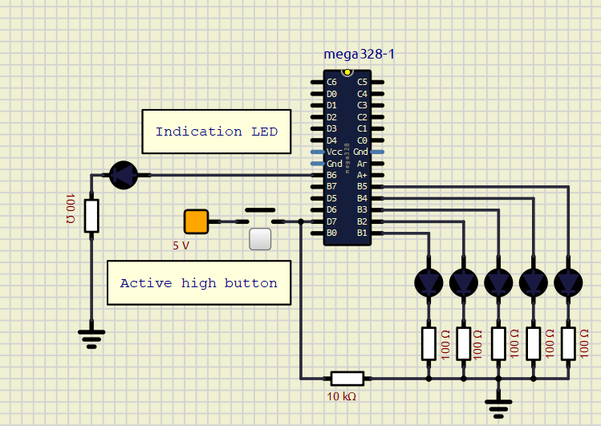

# digital-electronics2 lab_2

Tlačítko aktivní na logickou jedničku využívá funkci GPIO_mode_input_nopull. 

Pro ověření funkce GPIO_toggle jsou diody ve směru doprava zapínány/vypínány touto funkcí, v opačném směru pomocí funkcí  GPIO_write_low/high.

Kód má jeden funkční nedostatek - přepínání LED diod lze zastavit pouze držením tlačítka, dokud se neprovede poslední řádek ifu, který rozsvěcí/zhasíná diody.

   