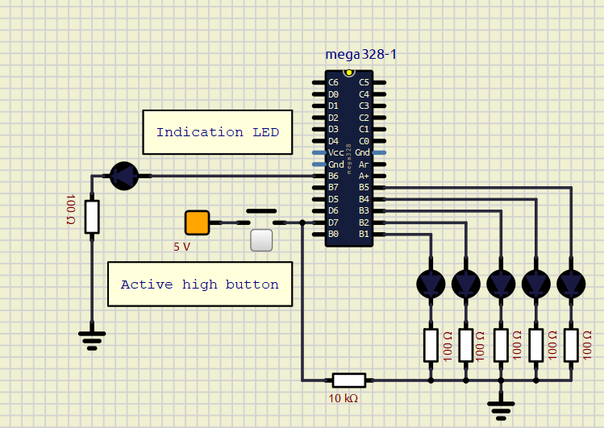

# digital-electronics2 lab_3

V souboru gpio.c byla upravena funkce toggle, nyní pomocí logické operace XOR.

Řada pěti LED je rozsvěcena a zhasínána za využití přerušení. Díky tomu je možné proces kdykoli zastavit, nemusí se čekat na delay.

   