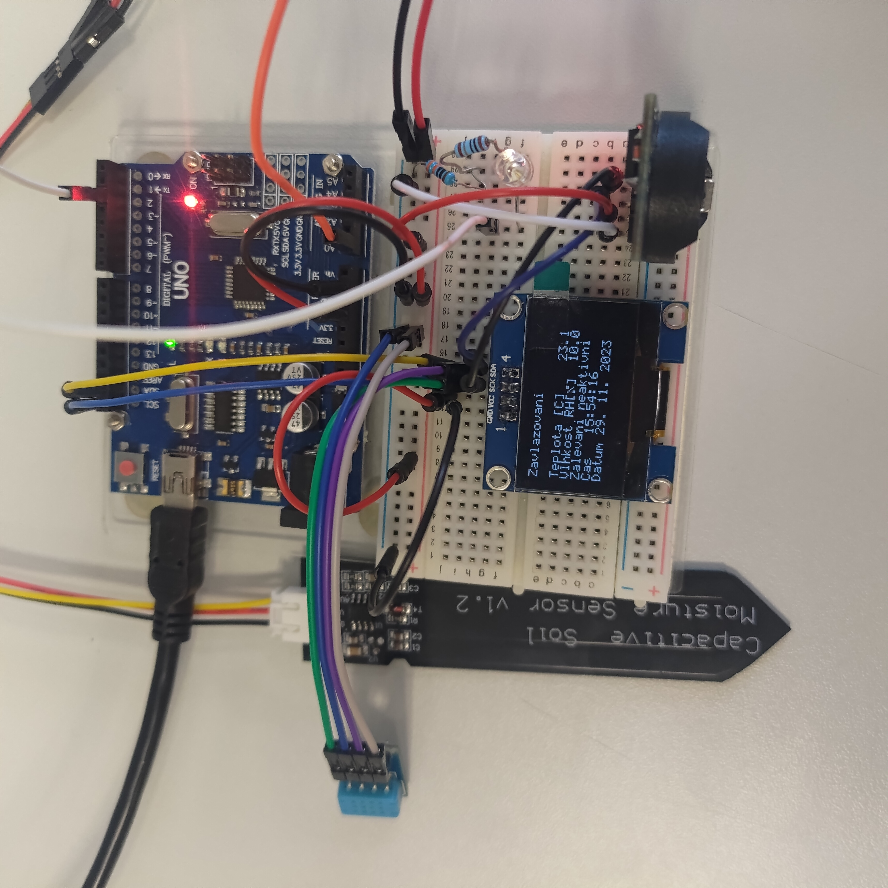
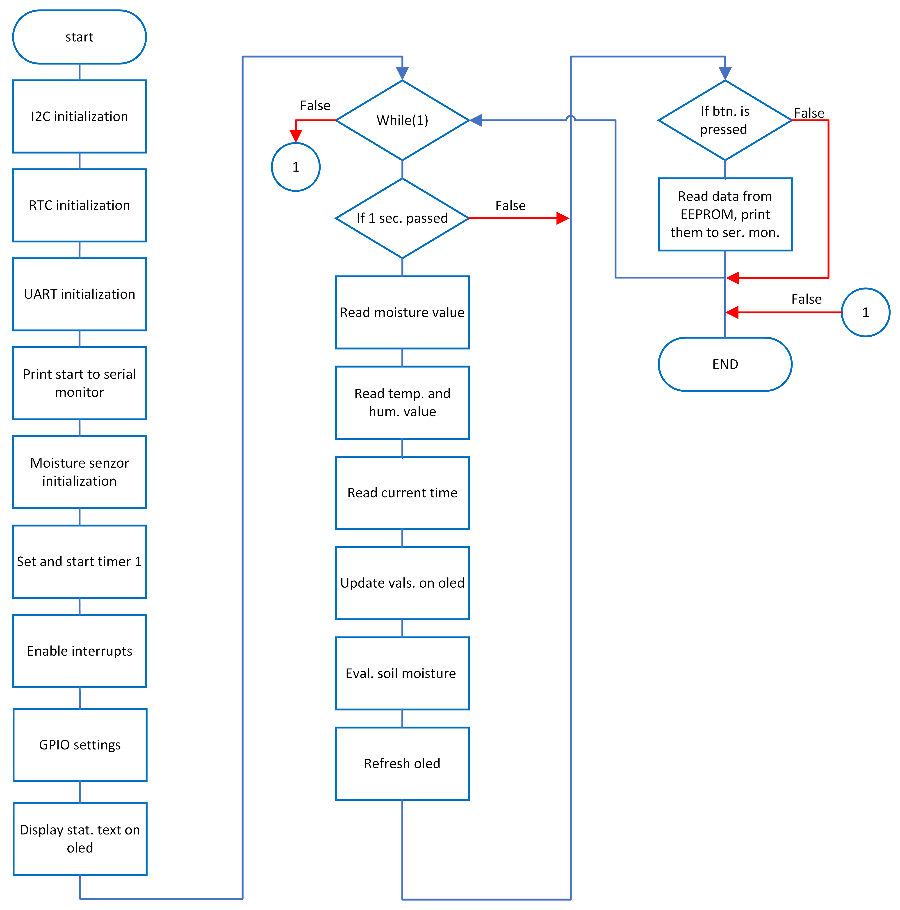

# Smart plant watering system and data logger

### Team members
Graf Daniel, Leikep Filip, Lipenský Lukáš, Kubeš Václav

## Theoretical description and explanation
The goal of this project was to design an embedded system which would use Arduino UNO board together with other external modules to create an automatic plant watering system. The modules which were used are air humidity sensor, soil moisture sensor and a module with RTC and EEPROM. An LCD panel is attached to display time, air humidity and soil moisture value.

## Hardware description of demo application
Air humidity sensor DHT12  
Capacitive soil moisture sensor V1.2  
LCD SH1106  
RTC DS3231  
EPROM AT24C32  

All components except the capacitive soil moisture sensor are connected through the I2C serial bus. The capacitive soil moisture sensor is connected to the pin `A0` to the internal ADC which converts the analog value to digital form which is then later used to determine the moisture of the soil. Watering process itself is in this project represented by an LED connected to the pin `PD2` which lights up when the watering process gets iniciated and turns off when the watering process ends but in real life application the LED would be replaced by a relay that would turn on/off a water pump. An RTC & EEPROM module with `DS3231 & AT24C32` IC`s is connected through I2C serial bus and keeps track of time and is also used for data logging. Checking data log can be done through a active low pushbutton connected to pin `PD3`.Temperature and relative humidity of air is measured by I2C sensor DHT12. An external OLED panel SH1106 is connected through I2C. It displays data such as air humidity (%), air temperature (°C), real time & date and the status of the watering process (active/inactive). Soil moisture isn't displayed because it is only an abstract number.

## Software description

All source files and library files are in
[lib](https://github.com/Filip-Leikep/digital-electronics2/tree/main/project/lib), [src](https://github.com/Filip-Leikep/digital-electronics2/tree/main/project/src):
- [TWI library](lib/twi) (sourced from doc. T. Fryza - see twi.h header)
- [UART library](lib/uart) (sourced from Peter Fleury - see uart.h header)
- [OLED library](lib/oled) (sourced from Michael Köhler - see oled.h header)
- [GPIO lobrary](lib/gpio)
- [EEPROM I2C library](lib/eeprom_i2c)
- [Moisture sensor library](lib/moisture_sens)
- [RTC module library](lib/rtc)
### Simplyfied flow chart of main:
  

### Description of main:
The process starts by initialiation of all I2C devices - temperature/humidity sensor, RTC, EEPROM and OLED. Also UART and ADC are initialized. Function displaytext puts static text on OLED. Values on OLED are updated every second, also they are put in UART.

The main function starts by declaring helper variables for detecting button presses. After that the I2C peripheral of the ATmega328P microcontroller is initialized with the `twi_init()` function and the current time and date are set in the RTC module which communicates over I2C (`RTC_init()`). Next step is preparing the peripheral that takes care of communication over the serial monitor with `uart_init()` function. For communication puroposes the symbol rate is set to 115200 baud and the information message "START" is sent to the serial monitor. The AD converter is then set up to read the analog voltage, which is the output of the soil moisture sensor (provided by the `moisture_sens_init()` function). Timing is done through the timer 1 which is set to overflow every second. In order to be able to track the overflow in real time, interrupts are enabled with the `sei()` command (interrupts are also used to read the moisture sensor). In the next part of the code input/output pins are set so that a relay can be connected to them to emulate watering (on pin `PD2`) and a active low control button connected to pin `PD3` which shows stored watering times and an indicator LED connected to pin `PB5` indicating the state of the watering system (on/off).

A condition is placed in the infinite loop that is always met when the new_data variable is set to 1 in the interrupt routine of timer 1. The interrupt routine of timer 1 is triggered every second. While the condition is met the moisture level of the soil is read using the `get_moisture()` function and and is stored in a global variable. The temperature and humidity of the environment are also determined using the DHT12 sensor using the `DHT_read()` function and are stored in a global structure. The current time and date are also read using the `RTC_now()` function. The values of temperature, humidity, and current time and date are prepared for display on the OLED using the `update_vals_oled()` function. The `watering()` function is called afterwardsand evaluates the read value of the soil moisture and if necessary, the watering process is initialized until the desired soil moisture is reached. It also writes the date and time of watering to EEPROM. The watering process is emulated by turning on the indicator LED and displaying information about active watering on the OLED display. The `oled_display()` function ensures that all new values are displayed on the OLED. The new_data variable is reset and the condition is only executed after it is set to 1 after one second. All of this is done if the condition is met. The microcontroller then determines the value of the button and if it is pressed, the `data_read()` function is called, which reads from EEPROM and outputs all watering entries to the serial monitor. Debouncing of the button is ensured by the helper condition (`if (check == 1)...`). This completes one cycle of the infinite loop and starts a new one.

## Instructions

1) Connect the Arduino board to a power supply
2) Put the capacitive moisture sensor into the soil in a way where only the warning line will be above the surface
3) Enjoy automative watering system with data logger
   
To check data logger:
1) Connect the Arduiono board to a PC
2) Push the button connected to the `PD3` pin
3) Open a software with UART serial monitor console and observe last stored date when watering process was activated
